# Tugas 1 IF3110 Pengembangan Aplikasi Berbasis Web | SaleProject

### Deskripsi Singkat

*SaleProject* adalah aplikasi marketplace berbasis web untuk membeli dan menjual barang apapun yang Anda inginkan.

### Anggota Tim PejuangWBD
Berikut anggota tim kami:
* 13514029 | [Muhammad Farhan Majid](https://www.facebook.com/hanmajid)
* 13514041 | [Varian Caesar](https://www.facebook.com/varian.caesar?fref=ts)
* 13514095 | [Muhammad Az-zahid Adhitya Silp](https://www.facebook.com/Azzahid025?fref=ts)

### Tools
*SaleProject* dibuat menggunakan tools berikut ini:
* Backend - [PHP] | [mySQL]
* Frontend - [Javascript] |  [CSS] | [HTML]

### Pembagian Tugas
Berikut pembagian tugas dari tim kami:
1. Tampilan
    * Login: 13514041
    * Register: 13514029
    * Catalog: 13514095
    * Confirmation Purchase: 13514029
    * Your Products: 13514029
    * Add Product: 13514041
    * Edit Product: 13514041
    * Sales: 13514095
    * Purchases: 13514095
2. Fungsionalitas
    * Login: 13514041
    * Register: 13514029
    * Catalog: 13514095
    * Confirmation Purchase: 13514029
    * Your Products: 13514029
    * Add Product: 13514041
    * Edit Product: 13514041
    * Sales: 13514095
    * Purchases: 13514095

### Screenshots
Berikut tampilan dari *SaleProject* kami:
#### Login
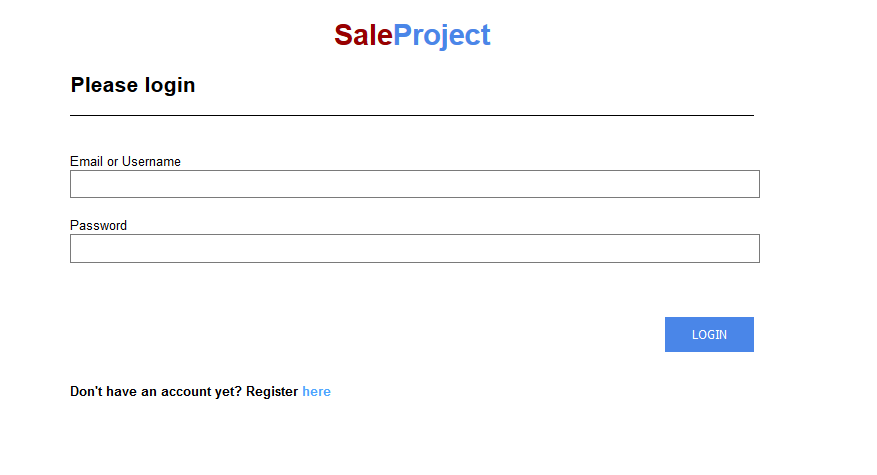

#### Register
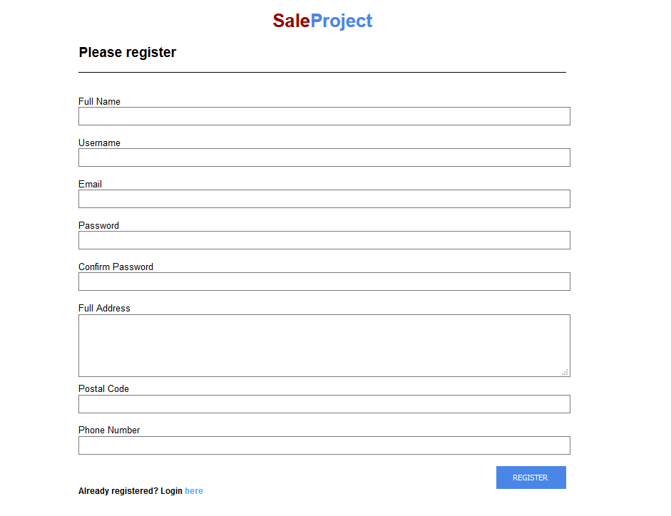

#### Catalog
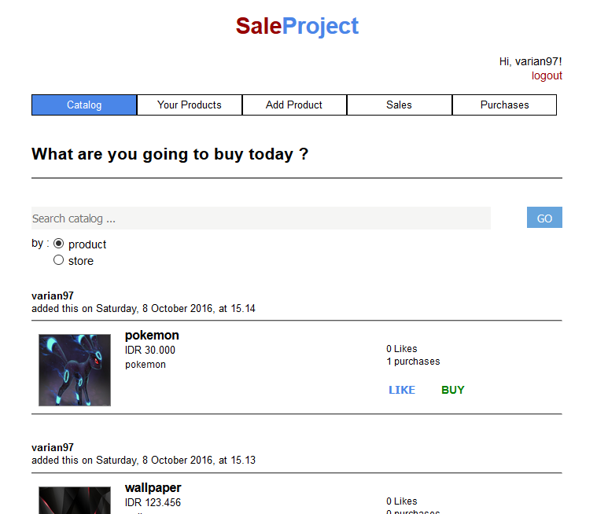
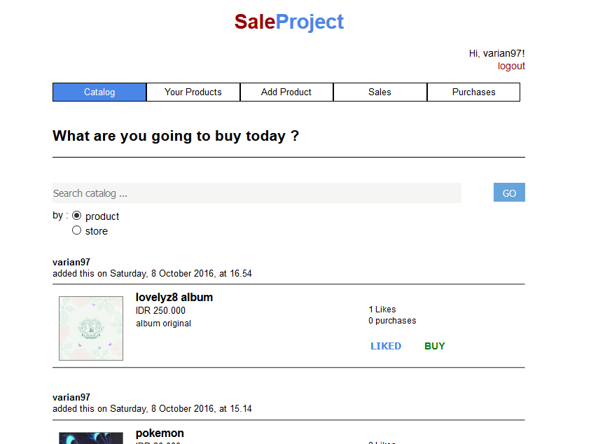
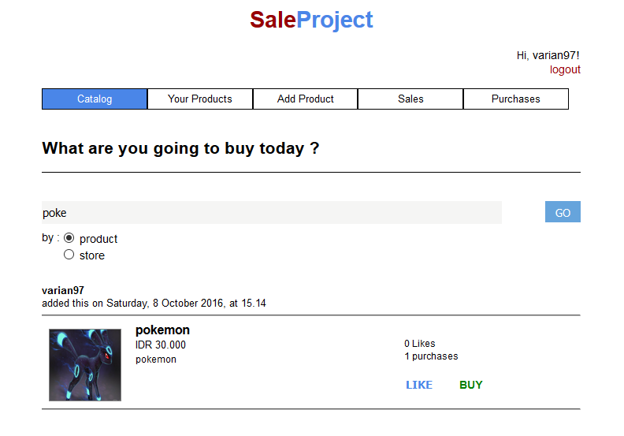

#### Confirmation Purchase
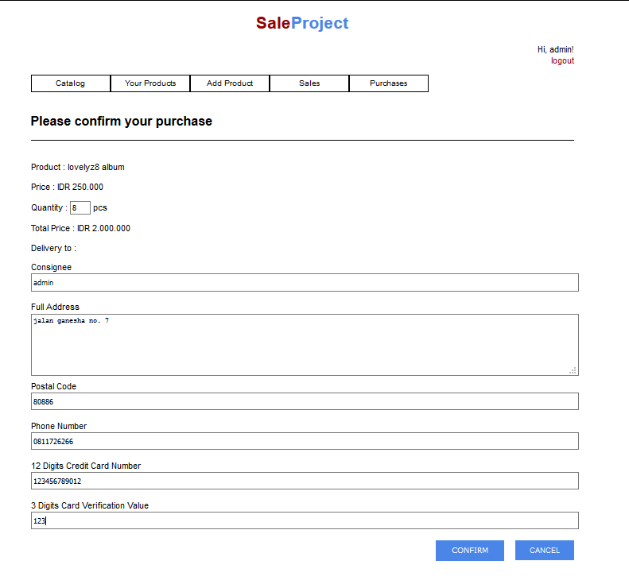

#### Your Products
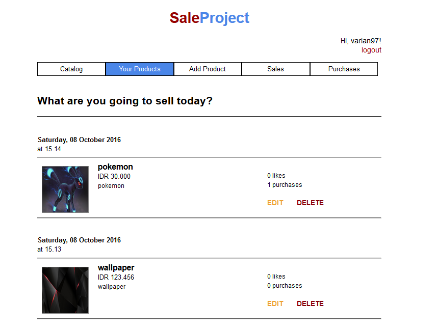

#### Add Product
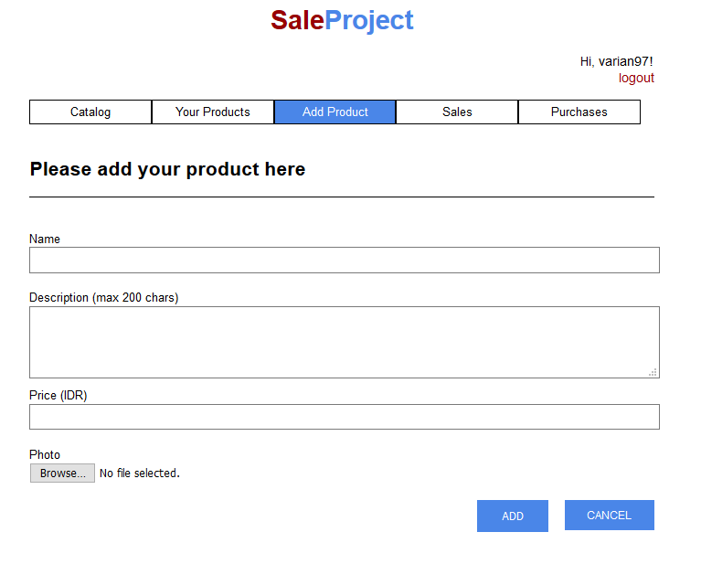

#### Edit Product
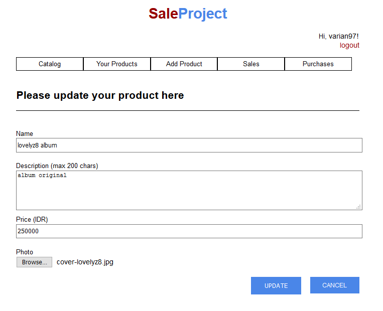

#### Sales
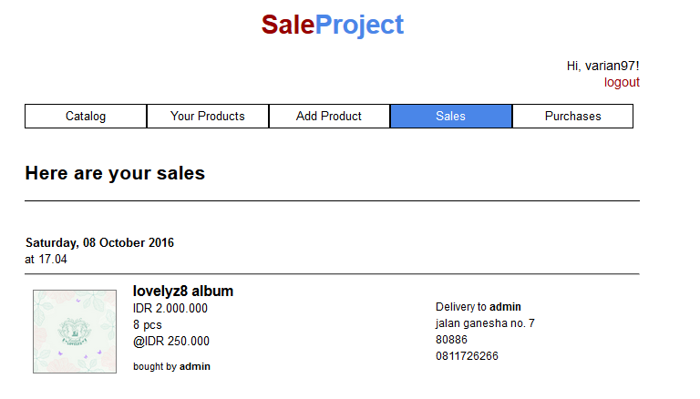

#### Purchase
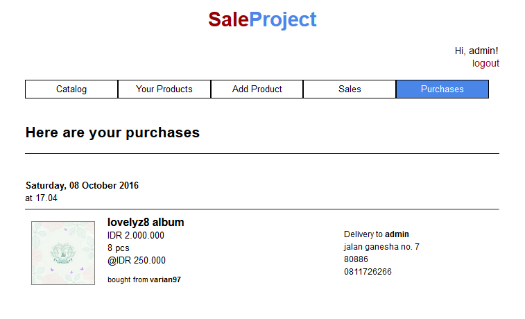

[//]: # (These are reference links used in the body of this note and get stripped out when the markdown processor does its job. There is no need to format nicely because it shouldn't be seen. Thanks SO - http://stackoverflow.com/questions/4823468/store-comments-in-markdown-syntax)
[PHP]: <https://php.net/>
[mysql]: <http://www.mysql.com/>
[Javascript]: <https://www.javascript.com/>
[CSS]: <https://en.wikipedia.org/wiki/Cascading_Style_Sheets>
[HTML]: <https://en.wikipedia.org/wiki/HTML>